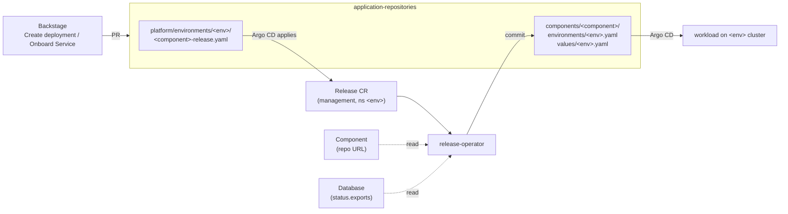
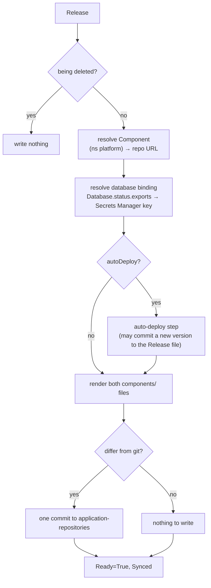
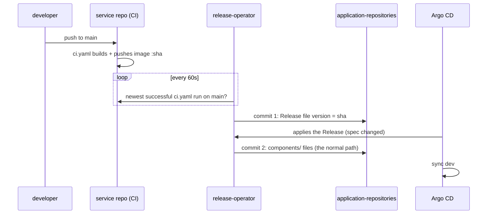
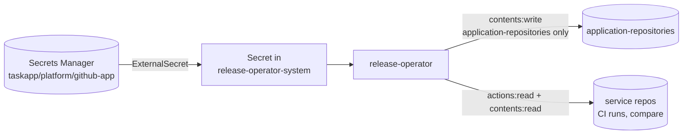

# release-operator

Turns a `Release` (`platform.taskapp.io/v1alpha1`), meaning *"component X runs
version Y in environment Z, with these bindings"*, into the GitOps files Argo CD
deploys from. It can also keep a dev Release on the newest green build of
`main` (**auto-deploy**). It runs on the `management` cluster, and its only
output is commits to
[`application-repositories`](https://github.com/entr0pian/application-repositories).

## Where it fits



People and Backstage write *intent*, the Release file. The operator writes
the *deployment files*, so nobody edits `components/` by hand. Git stays the
record of what runs where.

## The API

```yaml
apiVersion: platform.taskapp.io/v1alpha1
kind: Release
metadata:
  name: payments-dev
  namespace: dev               # one namespace per environment, on management
spec:
  componentRef: {name: payments}
  environment: dev             # matches an Argo CD cluster's environment label
  version: "<commit sha>"      # image tag AND chart revision
  autoDeploy: {branch: main}   # optional, dev only; operator moves version
  bindings:
    database: {enabled: true, ref: payments-db}   # optional
status:
  conditions: [Ready]          # reason: Synced, or why not (below)
  autoDeploy: {latestDeployable, runURL, reason, message}
```

Set `version`, `autoDeploy`, or both (CEL-validated). `autoDeploy` without a
`version` is how a service is onboarded before its first build.

## What a reconcile does



The two files it renders, using `payments` in dev as the example:

```yaml
# components/payments/environments/dev.yaml       # where the chart comes from
component: payments
environment: dev
namespace: dev
source:
  repoURL: https://github.com/entr0pian/payments.git
  targetRevision: <version>      # chart pinned to the same commit as the image
  chartPath: chart
---
# components/payments/values/dev.yaml              # what changes per deploy
image:
  tag: <version>
bindings:                        # only with an enabled database binding
  database: {type: secret, provider: aws-secrets-manager, remoteRef: /bindings/dev/databases/payments-db}
```

The chart and the image share one commit, so they always deploy and roll back
together. The workload's ExternalSecret reads `remoteRef` on its own cluster.
The Release never handles the credentials themselves.

## Auto-deploy



These guards keep it safe:

- **Dev only.** `--auto-deploy-environments` defaults to `dev`, and the
  operator enforces it, so a hand-written PR can't enable auto-deploy in prod.
- **Git wins.** Decisions read the Release file from git at a pinned head,
  and the commit uses that head as its parent. A merged change Argo CD
  hasn't applied yet is never overwritten.
- **Forward only.** GitHub's compare API must report the new build as ahead
  of the current version.
- **Never creates the file.** A missing Release file sets
  `ReleaseFileNotFound`, which avoids racing a teardown.
- **Cheap idle polls.** With nothing new, a poll is one GitHub call and a
  status write that changes nothing.

Commits are titled `Auto-deploy <component> <sha7> to <env>`, with a link to
the CI run. `status.autoDeploy.reason` is one of `UpToDate`, `Deploying`,
`WaitingForFirstBuild`, `NotFastForward` or `ReleaseFileNotFound`. The full
design rationale is in [`docs/AUTO_DEPLOY.md`](docs/AUTO_DEPLOY.md).

## When it isn't Ready

| Reason | Meaning |
|---|---|
| `ComponentNotFound`, `ComponentRepositoryNotReady` | Component missing, or its repo isn't created yet. Retried every 15s. |
| `DatabaseNotFound`, `ExportMissing`, `ExportNotReady` | Bound Database not there, or not yet published. Retried. |
| `InvalidSpec`, `ExportTypeUnsupported`, `ExportProviderUnsupported`, `DatabaseBindingInvalid` | Fix the Release or Database spec. |
| `AutoDeployNotAllowed` | `autoDeploy` set outside the allowed environments. |
| `AutoDeployFailed`, `SyncFailed` | GitHub call failed. Retried with backoff. |

## GitHub access

The operator authenticates as the **`taskapp-platform-deployer`** GitHub App,
so its commits show as `taskapp-platform-deployer[bot]`. The App has
Contents read/write and Actions read, and is installed on all repositories.



- **Tokens:** installation tokens are short-lived and narrowed per use. The
  clients are rebuilt when the Secret changes, so a rotated key needs no
  restart.
- **`--github-auth=pat`:** uses the shared `crossplane-github-credentials`
  token instead. It exists only for kind-based CI and e2e. The operator
  never falls back from the App to the PAT.

## Deployment and configuration

CI runs lint, test, e2e and the chart test. When all of them pass, it pushes
`ghcr.io/entr0pian/release-operator:<sha>`. Then `bump-infra` in
`application-repositories` pins `infra/release-operator`'s chart and image to
that same SHA, and Argo CD rolls it out to management. The Helm chart in
`chart/` is what's deployed; `config/` (kustomize) is only for local and e2e
deploys.

| Flag | Chart | Default |
|---|---|---|
| `--github-auth` | `github.auth` | `app` |
| `--github-owner` | `github.owner` | `entr0pian` |
| `--github-app-secret` | set by the chart to its ExternalSecret's target | Secret synced from `github.app.secretPath` (`taskapp/platform/github-app`) |
| `--auto-deploy-environments` | `manager.args` | `dev` |
| `--auto-deploy-poll-interval` | `manager.args` | `60s` |

## Development

```sh
make test       # unit + envtest; GitHub is an in-memory fake
make lint
make test-e2e   # kind cluster
go run ./cmd/main.go --github-auth=pat   # against your current kubeconfig
```

The API is defined in `api/v1alpha1/`. After changing it, run
`make manifests generate`, then mirror the new `config/crd/bases` CRD into
`chart/templates/crd/` (keep its Helm `if` wrapper).

## License

Apache 2.0. See the header in any source file.
