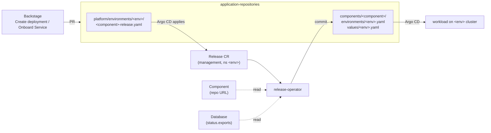
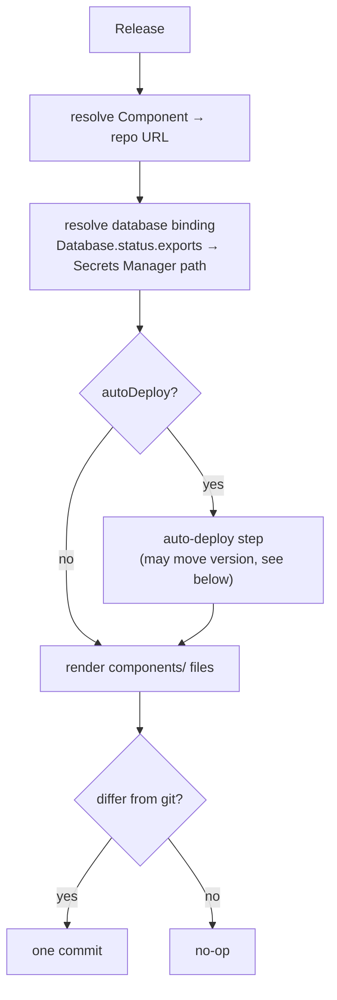
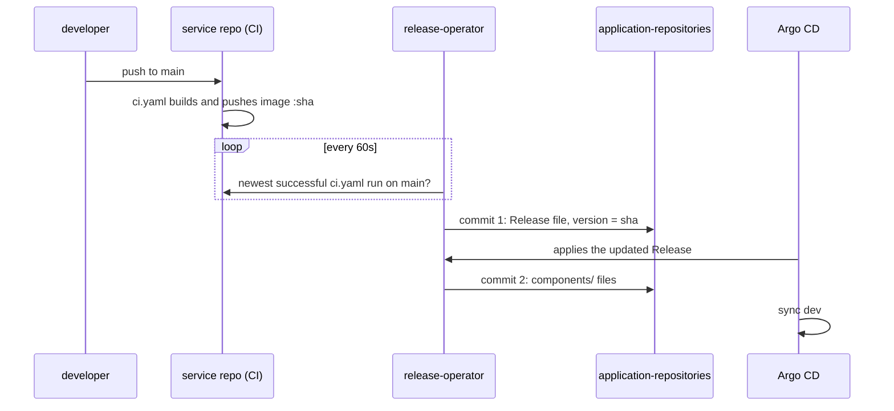
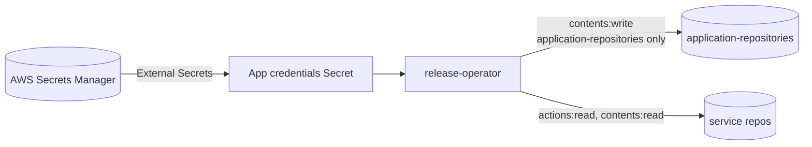

# release-operator

A Kubernetes operator that turns a **`Release`** (*"component X runs version Y
in environment Z, with these bindings"*) into the GitOps files Argo CD deploys
from. It can also keep dev on the newest green build of `main` without anyone
opening a PR.

- **GitOps-native.** Its only output is commits to
  [`application-repositories`](https://github.com/entr0pian/application-repositories).
  It never touches workloads directly, so git always says what runs where.
- **Safe auto-deploy.** Dev only, forward only, and it never overwrites a
  human change.
- **Least-privilege GitHub access.** It acts as a GitHub App, using
  short-lived tokens narrowed per call.
- **Tested against a real API server.** envtest exercises CRD validation
  and status behaviour, with GitHub replaced by an in-memory fake.

Written in Go with kubebuilder and controller-runtime. It runs on the
platform's `management` cluster.

## Where it fits



People and Backstage write the **intent**, which is the Release file. The
operator writes the **deployment files** derived from it. No one edits
`components/` by hand.

## The API

```yaml
apiVersion: platform.taskapp.io/v1alpha1
kind: Release
metadata:
  name: payments-dev
  namespace: dev               # one namespace per environment
spec:
  componentRef: {name: payments}
  environment: dev             # an Argo CD cluster's environment label
  version: "<commit sha>"      # image tag and chart revision
  autoDeploy: {branch: main}   # optional, dev only: the operator moves version
  bindings:
    database: {enabled: true, ref: payments-db}   # optional
status:
  conditions: [Ready]
  autoDeploy: {latestDeployable, runURL, reason, message}
```

`version`, `autoDeploy`, or both must be set; a CEL rule in the CRD enforces
this. A Release with `autoDeploy` and no `version` is how a new service is
onboarded before its first build.

## What it writes



For `payments` in dev:

```yaml
# components/payments/environments/dev.yaml
component: payments
environment: dev
namespace: dev
source:
  repoURL: https://github.com/entr0pian/payments.git
  targetRevision: <version>
  chartPath: chart
---
# components/payments/values/dev.yaml
image:
  tag: <version>
bindings:                    # only when a database binding is enabled
  database: {type: secret, provider: aws-secrets-manager, remoteRef: /bindings/dev/databases/payments-db}
```

The chart and the image are pinned to **the same commit**, so they always
deploy and roll back together. A binding carries only a *path* in Secrets
Manager. The workload's own ExternalSecret resolves it on its cluster, so
credentials never pass through the operator or git.

## Auto-deploy



The operator moves `version` *in git*, never on the cluster object.
Every deploy is therefore a reviewable commit, `Auto-deploy payments 85ee7ee to dev`,
which links its CI run. The guards:

| Guard | How |
|---|---|
| Dev only | `--auto-deploy-environments` (default `dev`) is enforced by the operator, not just the UI |
| Git wins | Reads the Release file at a pinned head and commits with that head as parent, so a concurrent merge makes the commit fail instead of being overwritten |
| Forward only | GitHub's compare API must report the new build *ahead* of the current version |
| Never creates files | A missing Release file means it was removed on purpose: `ReleaseFileNotFound` |
| Cheap when idle | A poll with nothing new is one GitHub call and a status write the API server drops as a no-op |

`status.autoDeploy.reason` reports the outcome: `UpToDate`, `Deploying`,
`WaitingForFirstBuild`, `NotFastForward` or `ReleaseFileNotFound`.

## GitHub access

The operator authenticates as the **`taskapp-platform-deployer`** GitHub App,
so its commits appear as `taskapp-platform-deployer[bot]`.



- **Tokens.** Installation tokens live for an hour, and each is scoped
  below what the App itself can do.
- **Key rotation.** A rotated key is picked up without a restart.
- **PAT mode.** `--github-auth=pat` exists only for kind-based CI. The
  operator never falls back from the App to a PAT.

## Design choices

- **Write git, not the cluster.** Patching `spec.version` on the cluster would
  be reverted by Argo CD's self-heal, and git would no longer record what runs.
- **Two commits per auto-deploy.** Each file kind has exactly one writer. The
  Release file is written by people or by auto-deploy, and `components/` only
  by the reconcile that follows. Argo CD's push webhooks keep the gap to
  seconds.
- **The operator writes the GitOps repo, not service CI.** This keeps write
  access to `application-repositories` out of every service repository.
- **Polling, not webhooks.** A 60s poll survives operator restarts and
  cluster rebuilds without any catch-up logic.
- **Foreign types read as unstructured.** `Component` and `Database` belong
  to other projects, and the operator doesn't vendor their Go types.

## Status

`Ready=True` (`Synced`) means the files in git match the Release. Otherwise
the reason says why:

| Reason | Meaning |
|---|---|
| `ComponentNotFound`, `ComponentRepositoryNotReady` | Component or its repo isn't there yet. Retries every 15s. |
| `DatabaseNotFound`, `ExportMissing`, `ExportNotReady` | Bound Database not ready yet. Retries every 15s. |
| `InvalidSpec`, `ExportTypeUnsupported`, `ExportProviderUnsupported` | The Release or Database spec needs fixing. |
| `AutoDeployNotAllowed` | `autoDeploy` set outside the allowed environments. |
| `AutoDeployFailed`, `SyncFailed` | A GitHub call failed. Retries with backoff. |

## Delivery

Every push runs lint, unit/envtest, e2e on kind, and a Helm install test. On
`main`, once all of them pass, CI pushes `ghcr.io/entr0pian/release-operator:<sha>`.
Then the shared `bump-infra` workflow pins this operator's chart *and* image
to that SHA in `application-repositories`, and Argo CD rolls it out. The
operator ships through the same GitOps path it implements for services.

| Flag | Default | |
|---|---|---|
| `--github-auth` | `app` | chart `github.auth` |
| `--github-owner` | `entr0pian` | chart `github.owner` |
| `--auto-deploy-environments` | `dev` | via `manager.args` |
| `--auto-deploy-poll-interval` | `60s` | via `manager.args` |

## Development

```sh
make test       # unit + envtest
make lint
make test-e2e   # kind cluster
go run ./cmd/main.go --github-auth=pat   # against the current kubeconfig
```

The API lives in `api/v1alpha1/`. After changing it, run
`make manifests generate` and mirror the CRD into `chart/templates/crd/`.

## License

Apache 2.0.
